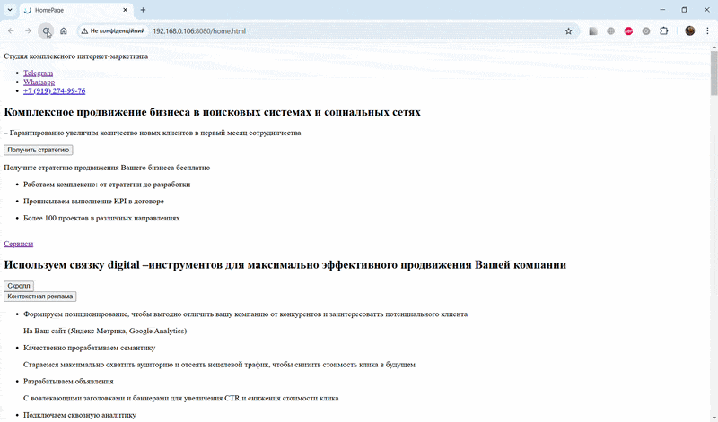

# Back to Business — Animated Landing Page

A visually polished, single-page landing built from a Figma design, with smooth scroll and hover animations — plain HTML, CSS, and JavaScript, no animation libraries.

🔗 **Demo:** https://zhuridochka.github.io/Back_to_business-show/home.html

## Pages
- `index.html` — entry page
- `home.html` — main landing content
- `common.html` — shared layout/includes

## Features
- Scroll-triggered and hover animations, built with pure CSS/JS for lightweight performance
- Pixel-accurate layout matching the design — spacing, color, typography
- Custom web fonts and icon assets taken directly from the design
- Fully responsive across desktop / tablet / mobile

## Stack
`HTML5` `CSS3` `JavaScript` · design — `Figma`
